<!-- <div align=center>

</div> -->

# 基于卷积神经网络的印刷体识别

>### 简介 `Brief introduction`
>这是我在中国石油大学(华东)本科期间机器学习课程的项目作业
>
>### 关于 `dataset` 文件夹的内容使用 `About the contents of the 'dataset' folder usage`
>
> 由于数据集过大，共约40G，不方便上传，这里把数据集生成代码上传运行 ` dataset/gen_printed_char.py` 文件可生成训练集图像，具体操作如下：
>
>```shell
>python gen_printed_char.py --out_dir [out_put_dir] --font_dir [windows_font_dir] --width [img_width] --height [img_height] --margin 4 --rotate 30 --rotate_step 1
>``` 

>### 关于 `train` 文件夹的内容使用 `About the contents of the 'train' folder usage`
> `train` 目录为训练目录，执行 `train_adam.py` 后可训练模型，`train_adam.py` 为使用 `adam` 优化器进行训练，若进行训练使用该文件
>
>### 关于 `test` 文件夹的内容使用 `About the contents of the 'test' folder usage`
>`test` 目录为检测图片目录，执行 `run/run.py` 后可将图片转为文字
>
>`run/run.py` 运行前依次指定：
>
>1. 要 `ocr` 识别的图片的目录
>
>2. 图像分割后的目录
> 
>3. 训练后的模型目录
>
>4. 汉字和 `id` 序号对应的文件
>
>之后可在控制台看到识别文字
>
>### 关于 `res` 文件夹的内容使用 `About the contents of the 'res' folder usage`
> `res` 目录为模型训练结果目录，包含 `Loss` 图像生成代码、 `Accuracy` 图像生成代码、 `Loss` 图像、 `Accuracy` 图像、 `Loss` 和 `Accuracy` 的原始数据

### 目录
- [基于卷积神经网络的印刷体识别](#基于卷积神经网络的印刷体识别)
    - [目录](#目录)
  - [一、研究意义](#一研究意义)
  - [二、数据描述](#二数据描述)
    - [1. 数据获取途径](#1-数据获取途径)
    - [2. 使用数据内容组成](#2-使用数据内容组成)
    - [3. 数据生成过程](#3-数据生成过程)
    - [4. 数据处理后的结果](#4-数据处理后的结果)
  - [三、模型描述](#三模型描述)
    - [1. 数据处理流程](#1-数据处理流程)
    - [2. 用到的算法](#2-用到的算法)
    - [3. 伪代码](#3-伪代码)
    - [4. 流程图](#4-流程图)
  - [四、算法实现](#四算法实现)
    - [1. `AlexNet` 卷积神经网络结构实现](#1-alexnet-卷积神经网络结构实现)
    - [2. 运行模型时图像分割算法实现](#2-运行模型时图像分割算法实现)
  - [五、运行结果及分析](#五运行结果及分析)
    - [1. 性能评价指标](#1-性能评价指标)
    - [2. 模型的训练结果和分析](#2-模型的训练结果和分析)
    - [3. 对未知图像进行分割预测的运行结果和分析](#3-对未知图像进行分割预测的运行结果和分析)
    - [总结 `summary`](#总结-summary)

## 一、研究意义

汉字作为中华民族文明发展的信息载体，已有数千年的历史，也是世界上使用人数最多的文字，它记录了璀璨的民族文化，展示了东方民族独特的思维和认知方法。随着计算机技术的推广应用，尤其是互联网的日益普及，人类越来越多地以计算机获得各种信息，大量的信息处理工作也都转移到计算机上进行。在日常生活和工作中，存在着大量的文字信息处理问题，因而将文字信息快速输入计算机的要求就变得非常迫切。现代社会的信息量空前丰富，其中绝大部分信息又是以印刷体的形式进行保存和传播的，这使得以键盘输入为主要手段的计算机输入设备变得相形见绌，输入速度低已经成为信息进入计算机系统的主要瓶颈，影响着整个系统的效率。


一方面，使用该技术可以提高计算机的使用效率，克服人与机器的矛盾。另一方面，该技术可以应用于快速识别身份证、银行卡、驾驶证等卡证类信息，将证件文字信息直接转换为可编辑文本，可以大大提高山东省相关部门工作效率，减少人力劳动成本，可以实时进行相关人员的身份核验，以便山东省各部门安全管理。

## 二、数据描述


### 1. 数据获取途径
利用 `Windows` 自带的字体文件库，用 `Python` 的 `PIL` 库绘图，每张图片上绘制一个文字，总共绘制 `3755` 个汉字，


### 2. 使用数据内容组成

根据汉字国标库绘图，同一字体生成 `976` 张图片作为训练集，生成 `244` 张图片作为训练中准确率的测试集，总共 `3755` 个汉字，训练集（不包含验证集）共 `3664880` 个文件，每个汉字有对应 `876` 张训练集图片和 `244` 张验证集图片，根据 `AlexNet` 要求每张图片大小应为 `227*227` 。

### 3. 数据生成过程
 1. 首先定义输入参数，其中包括输出目录、字体目录、测试集大小、图像尺寸、图像旋转幅度等等。

1. 接下来将得到的汉字与序号对应表读入内存，表示汉字序号到汉字的映射，用于后面的字体生成。

2. 我们对图像进行一定角度的旋转，将旋转角度存储到列表中，旋转角度的范围是 `[-rotate, rotate]` 。

3. 字体图像的生成使用的工具是 `Python` 自带的 `PIL` 库。该库里有图片生成函数，用该函数结合字体文件，可以生成我们想要的图片化的汉字。设定好生成的字体颜色为黑底白色，字体尺寸由输入参数来动态设定。

4. 同时，我们对生成的字体进行适当的膨胀和腐蚀，以扩大训练集数量。

5. 执行如下指令，开始生成印刷体文字汉字集。

    ```shell
    python gen_printed_char.py --out_dir [out_put_dir] --font_dir [windows_font_dir] --width [img_width] --height [img_height] --margin 4 --rotate 30 --rotate_step 1
    ```

6. 若生成 `227*227` 大小的图片，在 `2060` 显卡下总共生成时间近 `16` 小时，训练集共 `3664880` 个文件。

### 4. 数据处理后的结果

<div align=center>
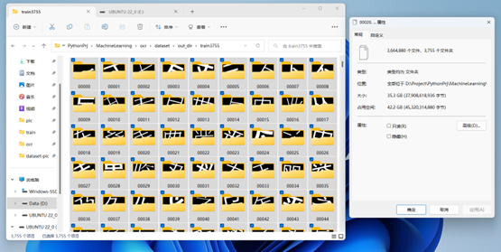

图1 训练集（不包含验证集）共3755个文字，总共3664880个文件

</div>


<div align=center>


图2 训练集每个汉字共876张图片

</div>


<div align=center>
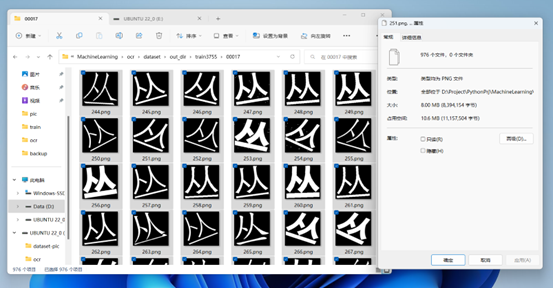

图3 验证集每个汉字共244张图片

</div>

## 三、模型描述

### 1. 数据处理流程

1.	AlexNet对图像大小要求为 `227*227` ，生成图像时已设置图像大小为 `227*227` ；

2.	使用 `pytorch` 的 `ImageFolder` 库进行图像文件的选择， `ImageFolder` 假设所有的文件按文件夹保存，每个文件夹下存储同一个类别的图片，文件夹名为类名；


3.	由于使用 `pytorch` 框架，需要将图像转换为 `Tensor`（张量）数据结构，利用 `torchvsion` 下面的 `transforms` 库将输入图片转换为 `Tensor` 格式，语句如下：

    ```py
    transforms = transforms.Compose([transforms.ToTensor()])
    data_test = ImageFolder(path_test, transform=transforms)
    ```
4.	使用 `pytorch` 的 `DataLoader` 库进行训练集的导入，此库导入训练集为成批导入，每一批既导入图像又导入标签，训练时根据每一批图片进行训练，通过设置 `batch_size` 可以控制每一批导入数据的量， `batch_size` 越小训练的轮次越多，本次实验设置 `batch_size` 为 `32` ，通过 `DataLoader` 导入训练集大致情况如下图所示：


<div align=center>
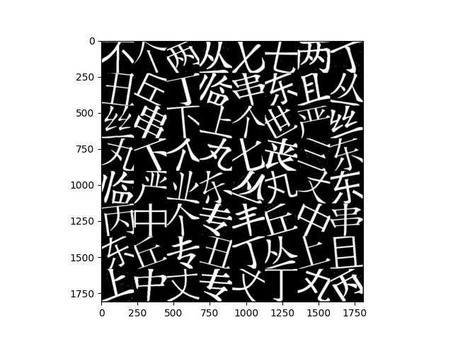
</div>
    
图4 一个batchsize输入的图像样例


1. 本次训练由于数据集较大，使用 `gpu` 加速，通过安装 `nvidia` 的 `cuda` 模块并下载 `pytorch` 的 `cuda 11.6` 版本配置 `pytorch` 环境，通过 `torch.cuda.is_available` 判断 `cuda` 是否可用，在可用的基础上通过 `device = torch.device("cuda")` 语句设置 `gpu` 硬件，并对通过 `DataLoader` 导入的每一批训练集数据通过 `images = images.to(device)` 和 `labels = labels.to(device)` 语句将训练集数据导入 `gpu` 。

### 2. 用到的算法
1. `AlexNet`卷积神经网络结构
    <div align=center>
    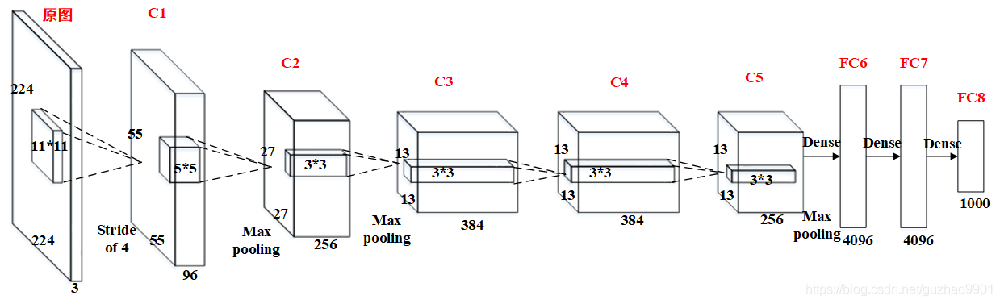
    </div>

    图5 AlexNet卷积神经网络结构

    

    1. `AlexNet` 网络第一个卷积层
    
        输入的图片大小为: `224*224*3` ，为后续处理方便，普遍改为 `227*227*3` ，第一个卷积层为: `11*11*3` ，卷积核尺寸为 `11*11` ,有 `96` 个卷积核，卷积步长为 `4` ，卷积层后使用 `ReLU` 激活函数,输出的尺寸为 `（227-11）/4+1=55` ，其输出的每个特征图大小为 `55*55*96`；

        最大池化层的池化核大小为 `3*3` ,步长为 `2` ,输出的尺寸为  `（55-3）/2+1=27` ，因此特征图的大小为: `27*27*96` 。

    2. `AlexNet` 网络第二个卷积层

        输入的数据为 `27*27*96` ，数据被 `256` 个大小为 `5*5*96` 的卷积核进行卷积运算,步长为 `1` ,填充值为 `2` ,卷积后使用 `ReLU` 层进行处理；
            
        最大池化层,核大小为 `3*3` ,步长为 `2` ；
    
    3. `AlexNet` 网络第三层至第五层卷积层
    
        第三层每组数据被尺寸为 `3*3*384` 的卷积核进行卷积运算,步长为 `1` ,填充值为 `1` ，卷积后使用 `ReLU` 层进行处理；
    
        第四层每组数据被尺寸大小为 `3*3*384` 的卷积核卷积运算,步长为 `1` 填充值为 `1` ，卷积后使用 `ReLU` 层进行处理；

    
        第五层每组数据都被尺寸大小为 `3*3*256` 的卷积核进行卷积运算,步长为 `1` ,填充值为 `1` ，卷积后使用 `ReLU` 层进行处理；

        Each set of data in the fifth layer is convolutioned by a convolution kernel with a size of 3\*3\*256, with a step size of 1 and a fill value of 1, and then processed using the ReLU layer after convolution;
    
        经过 `3*3` 池化窗口，步长为 `2` ，池化后输出像素层；

        After the 3\*3 pooling window, the step size is 2, and the pixel layer is output after pooling;


    4. `AlexNet` 网络第六层至第八层全连接层
    
        第六层首先以 `0.5` 的概率舍弃数据，经过共 `4096` 个神经元处理，之后经过 `ReLU` 层处理；

        The sixth layer first discards the data with a probability of 0.5, after a total of 4096 neuron processing, and then through the ReLU layer;
    
        第七六层首先以 `0.5` 的概率舍弃数据，输入 `4096` 个特征值，输出 `4096` 个特征值，之后经过 `ReLU` 层处理；

        The seventh and sixth layers first discard the data with a probability of 0.5, input 4096 eigenvalues, output 4096 eigenvalues, and then process it through the ReLU layer;
    
        第八层输入 `4096` 个特征值，输出 `3755` 个特征值。

        The eighth layer inputs 4096 eigenvalues and outputs 3755 eigenvalues.

2. `SGD` 梯度下降法
   
   算法原理：对损失函数进行一阶泰勒展开的近似，对近似函数求最小值，把最小值当作下一步用来迭代的值。

    
3. `Adam` 优化算法
   
   一种相对于 `SGD` 梯度下降更快的优化算法
 
### 3. 伪代码
1. `AlexNet` 网络结构伪代码
   ```py
    class Alexnet(nn.Module):
        def __init__(self, class_num = 3755):
            super(Alexnet, self).__init__()
            self.featureExtraction = nn.Sequential(
                nn.Conv2d(),nn.ReLU(),nn.MaxPool2d(),
                nn.Conv2d(),nn.ReLU(),nn.MaxPool2d(),
                nn.Conv2d(),nn.ReLU(),
                nn.Conv2d(),nn.ReLU(),
            nn.Conv2d(),nn.ReLU(),nn.MaxPool2d()
            )
            self.fc = nn.Sequential(
                nn.Dropout(),nn.Linear(),nn.ReLU(),
                nn.Dropout(),nn.Linear(),nn.ReLU(),
                nn.Linear())

        def forward(self, x):
            x = self.featureExtraction(x)
            x = x.view(x.size(0), 256*6*6)
            x = self.fc(x)
            return x

   ```
2. 模型训练伪代码（以 `Adam` 为优化器）
    ```py
    for epoch in range(epochs):
        for i, data in enumerate(train_loader):
            images, labels = data
            outputs = model(images)
            result_loss = loss(outputs,labels)
            opt_Adam.zero_grad()
            result_loss.backward()
            opt_Adam.step()
            train_step = train_step+1
            if(train_step%300==0):
                with torch.no_grad():
                    for test_data  in test_loader:
                        img_test,label_test = test_data
                        outputs_test = model(img_test)
            if(train_step%1000 == 0):
                torch.save()
    ```
### 4. 流程图
<div align=center>
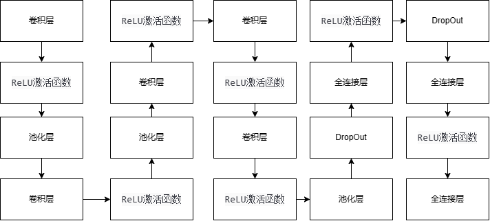
</div>

图6 AlexNet实现流程图


## 四、算法实现

### 1. `AlexNet` 卷积神经网络结构实现

1. 用 `torch.nn` 库建立 `AlexNet` 的 `python` 类，通过 `class Alexnet (nn.Module)` 语句将 `torch.nn` 下的 `Module` 传入类中。
   

2. 通过 `nn.Sequential` 方法构建一个序列容器，用于搭建神经网络的模块，卷积神经网络的各网络层按照传入构造器的顺序添加到 `nn.Sequential()` 容器中。

3. 同理，用 `nn.Sequential` 构造全连接层 `
      
4. 定义 `forward` 函数，在 `torch.nn` 模块中， `forward()` 函数执行实际的消息传递和计算，模型会自动执行网络的各层，并输出最后的特征
   
    ```py
    class Alexnet(nn.Module):
        def __init__(self, class_num = 3755):
            super(Alexnet, self).__init__()
            self.featureExtraction = nn.Sequential(
                nn.Conv2d(in_channels= 3, out_channels= 96, kernel_size= 11, stride= 4, bias= 0),
                nn.ReLU(inplace= True),
                nn.MaxPool2d(kernel_size= 3, stride= 2, padding= 0),
                nn.Conv2d(in_channels= 96, out_channels= 256, kernel_size= 5, stride= 1, padding = 2, bias= 0),
                nn.ReLU(inplace= True),
                nn.MaxPool2d(kernel_size=3, stride=2),
                nn.Conv2d(in_channels=256, out_channels=384, kernel_size=3, stride=1, padding=1, bias=0),
                nn.ReLU(inplace=True),
                nn.Conv2d(in_channels=384, out_channels=384, kernel_size= 3, stride=1, padding= 1, bias=0),
                nn.ReLU(inplace=True),
                nn.Conv2d(in_channels=384, out_channels=256, kernel_size= 3, stride= 1, padding= 1, bias=0),
                nn.ReLU(inplace=True),
                nn.MaxPool2d(kernel_size= 3, stride= 2, padding= 0)
            )
            self.fc = nn.Sequential(
                nn.Dropout(0.5),
                nn.Linear(in_features= 256*6*6, out_features= 4096),
                nn.ReLU(inplace= True),
                nn.Dropout(0.5),
                nn.Linear(in_features= 4096, out_features= 4096),
                nn.ReLU(inplace= True),
                nn.Linear(in_features= 4096, out_features= class_num)
            )

        def forward(self, x):
            x = self.featureExtraction(x)
            x = x.view(x.size(0), 256*6*6)
            x = self.fc(x)
            return x
    ```
### 2. 运行模型时图像分割算法实现

1. 要运行模型实现文字识别，第一步要考虑的就是怎么将每一个字符从图片中切割下来，然后才可以送入我们设计好的模型进行字符识别，切割算法总结为以下两个步骤：
   
   1. 对图片进行水平投影，找到每一行的上界限和下界限，进行行切割；

   2. 对切割出来的每一行，进行垂直投影，找到每一个字符的左右边界，进行单个字符的切割。

2. 对于行切割，即水平投影，是对一张图片的每一行元素进行统计，然后根据统计结果画出统计结果图，进而确定每一行的起始点和结束点，统计像素图如下所示：

<div align=center>
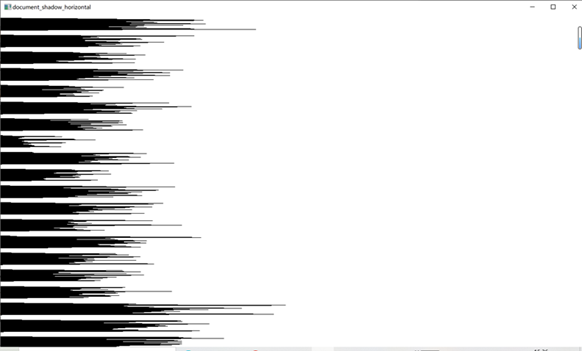
</div>

图7 水平行切割示意图

1. 切割完每一行后，我们得到了一行行文本，对这行文本进行垂直投影并根据垂直投影求出来每个字符的边界值进行单个字符切割，实现分割点效果如下：

    <div align=center>
    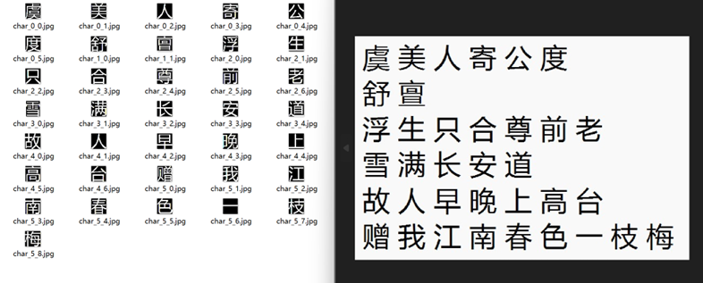
    </div>

    图8 实现分割效果

    

## 五、运行结果及分析

### 1. 性能评价指标

1. loss值（交叉熵函数值）
   
   本次实验使用pytorch的交叉熵库函数，其用来判定实际的输出与期望的输出的接近程度。它主要刻画的是实际输出（概率）与期望输出（概率）的距离，交叉熵的值越小，概率分布越接近，交叉熵函数计算公式如下：

   <div align=center>
    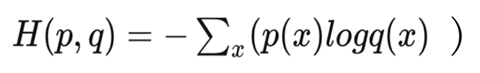

    图9 pytorch中交叉熵函数
    </div>

    

    通过语句 `loss = torch.nn.CrossEntropyLoss()` 获取交叉熵对象，在模型训练阶段，每次训练 `32` 张图片，每 `300` 次训练记录一次 `loss` 值（交叉熵函数值），并使用 `matplotlib` 绘制曲线图。


2. Accuracy值（预测集准确率值）
   
   本次实验训练阶段对预测集进行预测，根据预测结果与真实值比较，将预测准确的数量与总共计算的数量做比值，计算准确率，本次实验每次训练 `32` 张图片，每 `300` 次训练记录一次值 `Accuracy` 值（预测集准确率值），并使用 `matplotlib` 绘制曲线图。


### 2. 模型的训练结果和分析

1. `loss` 值（交叉熵函数值） `loss value (cross-entropy function value)`

    <div align=center>
    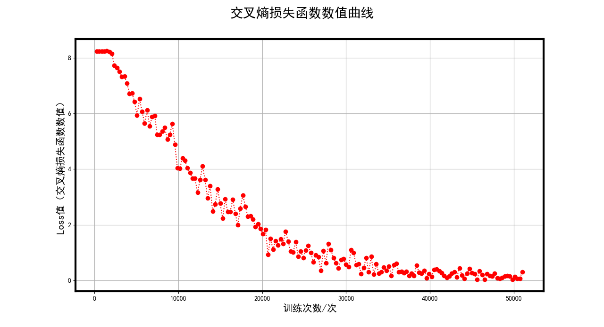

    图10 模型训练的Loss值（交叉熵损失函数值）曲线
    </div>

    

    观察图像可以看到 `Loss` 值下降幅度有震荡，但整体呈下降姿态，经过 `50000` 次训练结果较好，`Loss` 值接近 `0` ，但仍未完全达到 `0` 值，震荡原因考虑可能为学习率设置为 `0.00001` 较高，之后降低学习率为 `0.000001` ， `Loss` 值仍保持小幅度上下振动，但总体趋势不发生变化。


2. `Accuracy` 值（预测集准确率）`Accuracy value`
   
   <div align=center>
    

    图11 模型训练的Accuracy值（预测准确率值）曲线
    </div>

    

    观察图像可以看到 `Accuracy` 值上升幅度出现振荡现象，但整体呈上升姿态，经过 `50000` 次训练结果较好， `Accurarcy` 值接近 `1` ，但仍未完全达到 `1` 值，震荡原因考虑可能为学习率设置为 `0.00001` 较高，之后降低学习率为 `0.000001` ， `Accuracy` 值仍保持小幅度上下振动，但总体趋势不发生变化。


### 3. 对未知图像进行分割预测的运行结果和分析

1. 对于单个字体为48*48的文件，识别结果将“馨”字识别为“譬”字，其余均识别正确，如下图所示：
   
    <div align=center>
    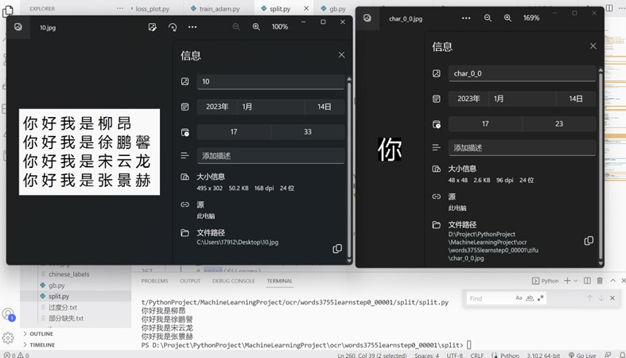

    图12 未知图像进行分割预测结果
    </div>

    

2. 对于单个字体为 `48*49` 的文件，识别结果将“亶”字识别为“膏”字，将“枝”字识别为“栈”字，其余均识别正确，准确率较好。


    <div align=center>
    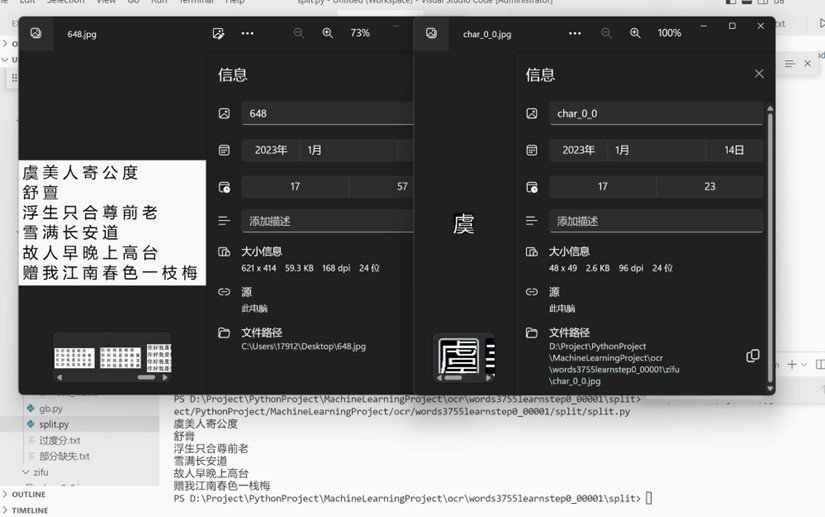

    图13 未知图像进行分割预测结果</div>

    

3. 对结果进行分析，由于AlexNet对读入的图片要求是 `227*227` ，本次训练数据集直接生成的 `227*227` 的图片，但是如上做未知图像的模型测试时输入的图片由于切割后几乎都比较小，经过放大后比较模糊，和训练的图片尺寸相差较大，可能会导致预测正确率不能达到训练时的预测正确率的问题，主要体现在相似字的识别上和复杂字的识别上。


### 总结 `summary`
1. 经过本次实验后，我们对神经网络的使用有了初步的理解，对 `pytorch` 框架有了使用经验，受益良多。


2. 在训练模型初期，由于数据集较大，约 `3664880` 张 `227*227` 的图片无论是图像生成还是模型训练，都需要消耗较大算力，因此取前 `30` 个字体进行模型训练，经过 `3` 小时左右训练后，模型 `loss` 值显著收敛。


    之后尝试用 `gpu` 加速对 `3755` 个字进行训练，下载了 `nvidia` 的 `cuda` 模块，并安装了 `cuda` 版本的 `pytorch` ，对 `3755` 张图片进行训练，由于图像较多，设置 `batchsize` 为 `512` ，但训练结果并不理想， `loss` 和 `accuracy` 保持几乎不变且表现均较差，之后查阅相关资料设置 `batchsize` 依次为 `128` 、 `64` 、 `32` ，并不断减小学习率，但效果依然较差。


    考虑到小样本上可以实现训练，故考虑样本过大的原因，计划将 `3755` 拆成多组进行训练，对 `1000` 字数据进行训练时发现，仍然不能收敛，故继续减小数据集到 `500` 、 `100` ，对 `100` 字训练时发现 `loss` 值和预测集的准确率值可以成功收敛，此时查阅资料发现有更好的优化器adam，而且经查阅资料发现梯度下降法 `sgd` 的表现明显不如 `adam` ， `adam` 优化方法梯度下降较快，故将优化器设置为 `adam` ，对 `100` 字进行训练，发现模型收敛速度相对于之前的训练快了很多，几乎是之前的数倍，欣喜之后将 `adam` 优化器用于 `1000` 字训练，发现模型的 `loss` 值仍收敛，故将 `adam` 优化器用于 `3755` 字的总体训练集，学习率设置为 `0.00001` 时发现可以收敛， `batchsize` 设置为 `32` 的情况下训练了 `50000` 次 `loss` 值降低到较低水平且总体保持不变， `accuracy` 值亦如此，之后将学习率进一步下调，但 `loss` 值和 `accuracy` 值仍保持一定整体水平变化不大，故结束训练。


3. 在进行图像预测时，意识到模型训练因为考虑 `AlexNet` 对图片的要求使用的图片较大为 `227*227` ，而待预测的图片由于分割普遍较小，故可能存在预测正确率和训练时的 `accuracy` 值有差别的现象。

   
4. 本次实验分工明确，图像生成采用的 `python` 自带的 `PIL` 库根据国标文字库进行图像绘制，由宋云龙同学负责；模型训练采用了 `pytorch` 框架实现了 `AlexNet` ，在 `GPU` 上进行模型训练并记录相关数值，由张景赫同学负责；训练完模型后，使用模型识别未知图片时需对图片分割，从而捕获单个字图片，由柳昂同学负责；对未知图像的具体预测工作由张景赫同学负责；文档撰写部分由张景赫和徐鹏馨负责。
